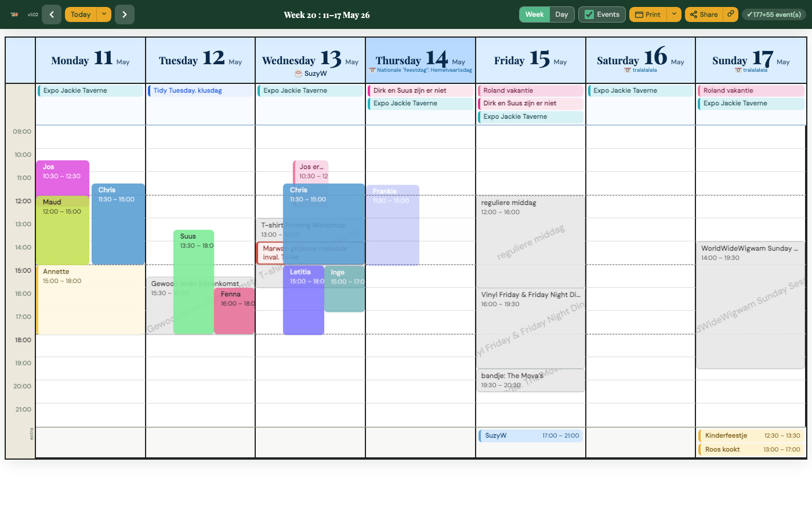
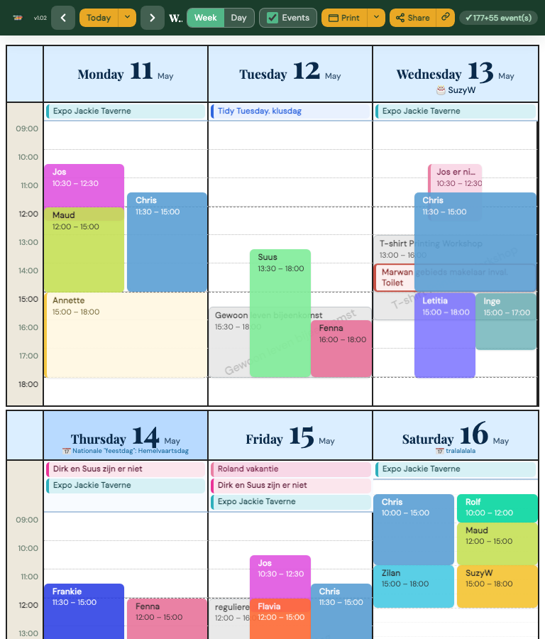
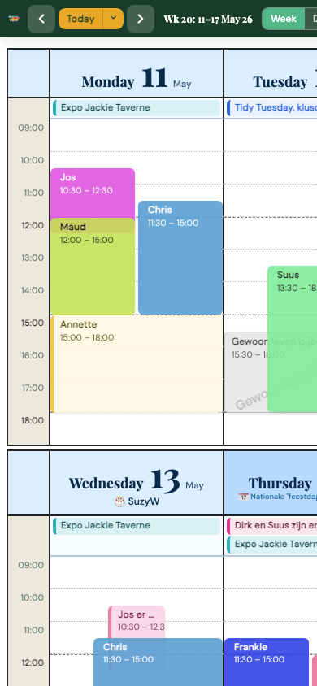
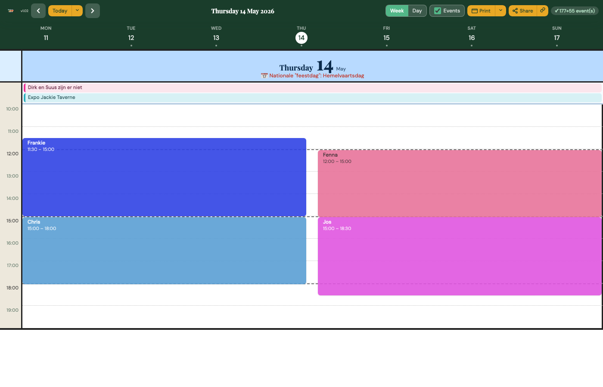

<p align="center">
  
</p>

# Overlap

**All rosters, calendars and events in one clear overview.**

<table align="right" style="margin-left:24px;border:none">
  <tr><td align="center"><br><sub>Week view — desktop</sub></td></tr>
  <tr><td align="center"><br><sub>Week view — medium screen (split layout)</sub></td></tr>
  <tr>
    <td align="center">
      
      <br>
      <sub>Mobile &nbsp;&nbsp;&nbsp;&nbsp;&nbsp;&nbsp;&nbsp;&nbsp;&nbsp;&nbsp;&nbsp;&nbsp;&nbsp;&nbsp;&nbsp;&nbsp;&nbsp;&nbsp;&nbsp;&nbsp;&nbsp;&nbsp;&nbsp;&nbsp;&nbsp;&nbsp;&nbsp;&nbsp;&nbsp;&nbsp;&nbsp;&nbsp;&nbsp;&nbsp;&nbsp;&nbsp;&nbsp;&nbsp; Day view</sub>
    </td>
  </tr>
</table>

Overlap is an open-source calendar viewer and management layer built for volunteer-driven organisations: neighbourhood centres, festivals, cultural venues, community initiatives and social projects. It pulls together multiple Google Calendars into a single, human-readable schedule — not as separate side-by-side agendas, but as one unified visual that shows at a glance who is working when, which activities are happening, where gaps exist, and where shifts or events overlap.

---

## Why Overlap?

Volunteer organisations run on people who make things happen together. A community centre, festival, cultural stage or social foundation typically deals with shifts, activities, meetings, absences, special appointments and last-minute changes — all scattered across multiple Google Calendars.

Overlap brings calm to that chaos.

A standard calendar shows events.
Overlap shows the organisation as a whole.

---

## What it shows

Any Google Calendar can be given a dedicated role. Typical layers include:

| Calendar | Example content |
|---|---|
| Volunteer roster | Who is on shift and when |
| Events | Public activities and performances |
| Kitchen / logistics | Prep sessions, setup and breakdown |
| Meetings | Internal coordination |
| Absences | Holidays, leave, unavailability |
| Appointments | External or one-off commitments |

Because all these layers appear together in a single view, the connections become immediately visible: a busy Sunday afternoon, a volunteer who is absent during a big event, an important appointment hidden in a crowded week — nothing disappears between the lines.

---

## Features

- **Multi-calendar overlay** — read multiple ICS feeds and render them as one visual schedule
- **Week view and day view** — responsive grid that adapts to desktop, tablet and phone
- **Day-view week strip** — tap any day chip to navigate; selected day highlighted with a filled circle
- **Full-screen day view** — day view stretches edge-to-edge for maximum readability
- **Colour-coded crew** — each volunteer gets a personal colour; shifts are instantly recognisable
- **All-day event pills** — multi-day events span across the top of the grid
- **Important dates** — holidays, school vacations and custom date ranges shown as labels on calendar days, managed via the admin panel (no hardcoded Amsterdam school calendar)
- **ICS import for important dates** — upload an `.ics` file; consecutive same-named events are automatically collapsed into date ranges
- **Always-show days** — configure which weekdays are always visible vs. hidden when empty
- **Week start** — choose Monday or Sunday as the first day of the week
- **Print** — landscape or portrait A4 with a dedicated print stylesheet
- **Share as image** — export the current view as a shareable PNG
- **PWA** — installable on Android (and iOS via Add to Home Screen); works offline after first load
- **No database** — the entire configuration lives in a single JavaScript file (`overlap-config.js`)

---

## Admin panel (`/manage`)

A PHP-based management interface lets you configure everything through a browser — no file editing required.

| Page | What you can manage |
|---|---|
| **Dashboard** | Quick status overview |
| **Calendars** | ICS feed URLs with live test button |
| **Volunteers** | Crew names and colours |
| **Schedule** | Week start day, always-show days, important dates, ICS import |
| **Display** | Branding (name, logo, theme colour), font scales, filter keywords |

Changes are written back to `overlap-config.js` immediately. The manifest (`overlap-manifest.json`) and PWA icons are regenerated automatically when branding is saved.

---

## Architecture

```
overlap/
├── index.html                  # Main calendar app (PWA shell)
├── app/
│   ├── overlap.js              # Calendar engine (rendering, ICS parsing, Google API)
│   ├── overlap.css             # Calendar styles
│   ├── overlap-config.js       # Live config (generated; do not edit by hand)
│   ├── overlap-manifest.json   # PWA manifest (auto-generated from branding)
│   ├── proxy.php               # Server-side ICS proxy and cache (15 min)
│   ├── icon-192.png            # PWA icon — overwritten on logo upload
│   └── icon-512.png            # PWA icon — overwritten on logo upload
├── manage/
│   ├── index.php               # Dashboard
│   ├── calendars.php           # Calendar URL management
│   ├── volunteers.php          # Crew management
│   ├── schedule.php            # Schedule settings + important dates + ICS import
│   ├── display.php             # Branding + display settings + logo upload
│   ├── api.php                 # AJAX endpoint (calendar test, etc.)
│   ├── _header.php             # Shared nav header
│   └── _footer.php             # Shared footer
├── lib/
│   ├── Config.php              # JS config reader/writer (no database needed)
│   └── CalendarDiagnostics.php # ICS fetch, parse and health-check
├── assets/
│   ├── css/admin.css           # Admin panel styles
│   └── js/admin.js             # Admin panel JS (crew sort, calendar test, toasts)
└── uploads/
    └── logo.png                # Uploaded logo (source for icon resizing)
```

---

## Setup

### Requirements

- PHP 8.0+ with GD extension (for logo resizing)
- A web server (Apache, Nginx, Plesk) with PHP enabled
- One or more public Google Calendar ICS URLs

### Installation

1. **Upload** all files to your web root or a subdirectory (e.g. `/overlap/`).

2. **Copy the example config:**
   ```bash
   cp app/overlap-config.example.js app/overlap-config.js
   ```

3. **Set write permissions** on the config and icon files so PHP can update them:
   ```bash
   chmod 664 app/overlap-config.js app/overlap-manifest.json app/icon-192.png app/icon-512.png
   chmod 775 uploads/
   ```
   On Plesk/SuExec, make sure the files are owned by the PHP user (e.g. `chown -R user:psacln`).

4. **Open `/manage/display.php`** in your browser and fill in your branding, then go through Calendars, Volunteers and Schedule.

5. **Open `index.html`** — your calendar is live.

### Proxy

All ICS feeds are fetched server-side through `app/proxy.php`, which:
- Caches responses for 15 minutes
- Only allows URLs listed in the configuration (no open proxy)

---

## Configuration

The config file `app/overlap-config.js` is a plain JavaScript file with three sections:

```js
window.OVERLAP_CONFIG = {
  branding: {
    appName:        'My Organisation',
    appShortName:   'MyOrg',
    logoUrl:        'https://example.com/logo.png',
    themeColor:     '#1a3d2b',
    startUrl:       'https://example.com/overlap/index.html',
    // ...
  },
  crew: [
    { name: 'Alice', color: '#52b788' },
    { name: 'Bob',   color: '#5a9fd4', bday: '15-03' },
    // ...
  ],
  defaults: {
    calendarUrl:          'https://calendar.google.com/calendar/ical/…',
    appointmentUrl:       'https://calendar.google.com/calendar/ical/…',
    mainEventCalendarUrl: 'https://calendar.google.com/calendar/ical/…',
    weekStartDay:         1,           // 0 = Sunday, 1 = Monday
    alwaysShowDays:       [0,1,3,4,5,6],
    importantDates: [
      { date: '2026-12-25', label: 'Christmas' },
      { date: '2026-07-01', endDate: '2026-08-31', label: 'Summer vacation' },
    ],
    filterKeywords:       ['regular day'],
    fontScale:            1,
    printFontScale:       2,
    timeZone:             'Europe/Amsterdam',
  }
};

// overlap.js reads ROOSTER_CONFIG internally — keep this alias
window.ROOSTER_CONFIG = window.OVERLAP_CONFIG;
```

An example file with all options and empty sensitive values is provided at `app/overlap-config.example.js`.

---

## Important dates and ICS import

The **Schedule** admin page lets you define holidays, school vacations and other notable dates that appear as labels on calendar day headers.

- Single day: just set a **From** date and a **Label**
- Date range: set both **From** and **Until**

You can also **import an `.ics` file** (e.g. a national holiday calendar or school vacation feed). The importer:
- Parses every `VEVENT` block
- Adjusts the exclusive `DTEND` to an inclusive end date
- **Automatically collapses consecutive same-named events into a single range** (e.g. 9 individual "Summer vacation" days become one row)

The built-in Amsterdam school calendar and Dutch public holiday list that were part of the original `overlap.js` engine are disabled; the admin-managed important dates system is the sole source for day labels.

---

## PWA / installation

The app ships with a web manifest and service worker hooks so it can be installed:

- **Android**: tap the browser menu → "Add to Home Screen" or "Install app"
- **iOS**: tap Share → "Add to Home Screen"
- **Desktop Chrome/Edge**: install button in the address bar

The PWA icons (`icon-192.png` and `icon-512.png`) are automatically generated from the logo you upload in the Display settings — centre-cropped to square and resampled to the correct size.

---

## Contributing

Pull requests and issues are welcome. The admin panel is deliberately kept framework-free (plain PHP + vanilla JS) to make it easy to host anywhere without a build step.

---

## Licence

MIT — free to use, modify and redistribute. Attribution appreciated but not required.
